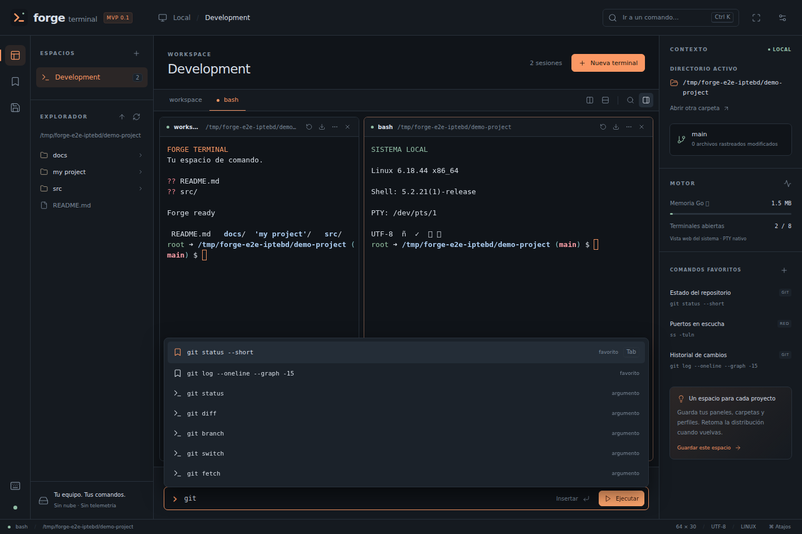

# Forge Terminal

Una terminal de escritorio para Windows y Linux, con paneles ajustables,
autocompletado y espacios de trabajo. **MVP 0.1.0 · x64 · MIT**



## Empezar con los ejecutables

No necesitas instalar Go, Node.js ni npm para usar los binarios.

### Windows

1. Descomprime el paquete `forge-terminal-0.1.0-windows-x64.zip`.
2. Abre `forge.exe`.
3. Selecciona tu shell desde **Nueva terminal**: PowerShell 7, Windows PowerShell,
   CMD o WSL, según lo instalado en tu equipo.

Requisitos: Windows 10 1809 o posterior / Windows 11, x64, y
[Microsoft Edge WebView2 Runtime](https://developer.microsoft.com/microsoft-edge/webview2/).
Si falta ese componente, instala su versión Evergreen. El ejecutable no está
firmado digitalmente; su editor aparecerá como desconocido.

El paquete contiene un `.exe` real, compilado para Windows. La ejecución nativa
en Windows no se pudo validar durante esta entrega.

### Linux

Descomprime `forge-terminal-0.1.0-linux-x64.zip` e instala el motor gráfico del
sistema si todavía no lo tienes:

```bash
# Fedora Workstation / escritorio en Fedora
sudo dnf install gtk3 webkit2gtk4.1

# Ubuntu 24.04 / Debian con WebKitGTK 4.1
sudo apt install libwebkit2gtk-4.1-0
```

Desde la carpeta descomprimida:

```bash
chmod +x forge
./forge
```

Para agregarlo al menú de aplicaciones de tu usuario:

```bash
bash install-linux.sh
```

El instalador opcional requiere Python 3, copia el binario a `~/.local/bin/forge`
y registra el icono y el acceso de escritorio. No instala paquetes ni usa sudo.

El ejecutable Linux se enlaza dinámicamente con GTK 3 y WebKitGTK 4.1. La base de
compilación es Ubuntu 24.04 x64. Fedora 44 es un objetivo compatible con esos
componentes, pendiente de prueba de escritorio en esa distribución.

**Fedora Server sin escritorio:** la ventana nativa necesita una sesión gráfica.
Puedes ejecutar `./forge --serve` para usar la misma interfaz desde un navegador
en ese equipo. El programa imprime una URL local temporal de acceso. El servicio
solo escucha en `127.0.0.1`; no queda publicado en la red.

## Qué puedes hacer

| Función | Uso |
|---|---|
| Terminal real | Ejecuta tus programas, SSH, editores de consola y herramientas habituales. Usa PTY en Linux y ConPTY en Windows. |
| Paneles | Divide en columnas o filas, combina divisiones, arrastra separadores y renombra paneles. Máximo ocho paneles entre todos los espacios. |
| Espacios | Agrupa carpetas y shells por proyecto. Doble clic en el nombre para renombrar. Se guarda la distribución. |
| Compositor | Escribe abajo y usa Tab para elegir una sugerencia. **Insertar** envía texto; **Ejecutar** también envía Enter al panel activo. |
| Autocompletado | Comandos de PATH, carpetas, archivos, favoritos y argumentos de Git, Docker, Podman, systemctl, npm y Go. |
| Tab del shell | Dentro de la terminal se conserva el completado nativo de Bash, Zsh, Fish o PowerShell. |
| Favoritos | Guarda comandos propios y selecciónalos para revisarlos en el compositor. Nunca se ejecutan al seleccionarlos. |
| Explorador | Navega carpetas; clic derecho en una carpeta abre el selector de terminal allí. Un archivo inserta su ruta en el compositor. |
| Contexto Git | Muestra rama y cantidad de archivos **rastreados** modificados en el directorio activo. |
| Paleta | Encuentra acciones, preferencias y favoritos con Ctrl+K. |
| Búsqueda | Busca en las líneas que retiene cada terminal. |
| Enfoque | Oculta paneles laterales para dar espacio al terminal. |
| Exportar salida | Guarda el buffer retenido en un archivo de texto y muestra su ruta. |
| Personalización | Temas Obsidiana, Medianoche y Papel; fuente de 11 a 22 px; paneles y scrollback configurables. |

Las sugerencias son locales y no requieren IA ni conexión a Internet. No se
ejecutan comandos para calcular completados. Los snippets dependen del shell
seleccionado: puedes editar o reemplazar los favoritos de ejemplo.

El compositor envía texto a **la sesión activa**: úsalo cuando estés en el prompt
del shell y la línea de entrada esté vacía. En una aplicación interactiva, usa su
entrada normal. El pegado de varias líneas pide revisar el contenido.

## Atajos

| Atajo | Acción |
|---|---|
| `Ctrl+K` | Paleta de comandos |
| `Ctrl+Espacio` | Enfocar el compositor |
| `Ctrl+Shift+T` | Nueva terminal |
| `Ctrl+Shift+D` | Dividir en columnas |
| `Ctrl+Shift+E` | Dividir en filas |
| `Alt+1` … `Alt+8` | Enfocar panel dentro del espacio |
| `Ctrl+Shift+G` | Buscar en la salida |
| `Ctrl+Shift+F` | Alternar modo enfoque |
| `Ctrl+Shift+S` | Guardar espacio |
| `Ctrl+Shift+W` | Cerrar panel, con confirmación |
| `Ctrl+Shift+C` / `Ctrl+Shift+V` | Copiar selección / pegar |
| `Enter` en compositor | Ejecutar texto |
| `Shift+Enter` en compositor | Insertar sin enviar Enter |
| `Tab` en compositor | Aceptar sugerencia |

Si el acceso al portapapeles está restringido por el motor del sistema, `Ctrl+V`
conserva el pegado normal del terminal. `Ctrl+C` sigue siendo interrupción del
programa y `Ctrl+R` conserva la búsqueda de historial del shell.

## Sesiones y configuración

Las preferencias se guardan en:

- Linux: `$XDG_CONFIG_HOME/forge-terminal/settings.json`, normalmente
  `~/.config/forge-terminal/settings.json`.
- Windows: `%AppData%\forge-terminal\settings.json`.
- Exportaciones: subcarpeta `exports` dentro de esa misma carpeta.

Puedes indicar otra carpeta con `--config-dir RUTA`. El motor web también puede
crear su propio directorio de caché, en particular `forge.exe.WebView2` en Windows.

Al reabrir se restauran nombres, carpetas, perfiles y paneles. **Se crean shells
nuevos:** los procesos anteriores y su salida no sobreviven al cierre. La salida
no se graba automáticamente. El historial del compositor está deshabilitado por
defecto; si lo habilitas, conserva hasta 100 entradas locales sin cifrado. No
registra las teclas de la terminal ni lee el historial privado del shell.

El directorio activo sigue al shell mediante `/proc` en Linux y OSC 7 en
PowerShell. PowerShell añade ese anuncio conservando el prompt del perfil, sin
editar sus archivos. En CMD el contexto conserva la carpeta inicial. En WSL,
los archivos del explorador son del host Windows y el completado de rutas Linux
se usa mediante Tab dentro de WSL.

## Tamaño y recursos

- Binarios de aproximadamente **8 MB**, con HTML, CSS, JavaScript e iconos
  incluidos. Consulta los tamaños exactos en `reports/validation.md`.
- Utiliza la vista web del sistema; no incorpora Electron ni otro navegador
  completo en el paquete.
- Una sola vista web para todos los paneles; cada panel tiene su propio shell.
- Hasta ocho paneles. Scrollback predeterminado: 3.000 líneas por panel.
- Control de flujo: limita datos pendientes entre PTY y renderizado.
- Sin animaciones permanentes ni parpadeo del cursor. Métricas espaciadas cada
  cinco segundos; actualización suspendida cuando el documento está oculto.

La cifra **Memoria Go** del panel mide únicamente el heap del backend. **No es la
RAM total:** hay que sumar WebView, shell y programas ejecutados. La RAM total de
las ventanas nativas no se midió en este entorno. El tamaño pequeño del binario
no garantiza un consumo equivalente al de una terminal renderizada sin WebView.

## Compilar desde el código fuente

Requisitos comunes: Go 1.26 o superior, Node.js 20 o superior y npm. Las
dependencias de JavaScript tienen versiones fijadas en `package-lock.json`;
las de Go están en `go.mod` / `go.sum`.

### Linux

```bash
# Fedora: dependencias para compilar
sudo dnf install gcc gcc-c++ pkgconf-pkg-config gtk3-devel webkit2gtk4.1-devel

# Ubuntu: dependencias para compilar
sudo apt install build-essential pkg-config libgtk-3-dev libwebkit2gtk-4.1-dev

cd ~/Development/projects/forge-terminal
npm ci
bash scripts/build.sh
./build/forge-linux-x64
```

### Windows

Instala Go, Node.js y [MSYS2](https://www.msys2.org/). En la consola **MSYS2
MINGW64** instala `mingw-w64-x86_64-gcc`. Agrega `C:\msys64\mingw64\bin` a PATH
y abre una nueva consola PowerShell:

```powershell
cd C:\Development\projects\forge-terminal
npm.cmd ci
& .\scripts\build-windows.ps1
.\build\forge.exe
```

También puedes compilar el `.exe` desde Linux con MinGW-w64:

```bash
sudo apt install gcc-mingw-w64-x86-64 g++-mingw-w64-x86-64
bash scripts/build-cross-windows.sh
```

El recurso Windows compilado está incluido en el código. Si cambias el icono o
el manifiesto, regenera `src/cmd/forge/icon_windows_amd64.syso`:

```bash
cd assets
x86_64-w64-mingw32-windres forge.rc -O coff -o ../src/cmd/forge/icon_windows_amd64.syso
```

### Desarrollo de la interfaz

```bash
npm run build:ui
go run -tags headless ./src/cmd/forge --serve
```

Abre la URL temporal que imprime el programa. El modo headless conserva PTY,
autocompletado y todas las funciones; solo cambia la forma de abrir la ventana.
No hay un shell simulado en la vista de desarrollo.

## Verificar

```bash
npm ci
npx playwright install chromium
python3 scripts/quality_gate.py
```

El gate ejecuta pruebas Go con detector de carreras, `go vet`, pruebas del árbol
de paneles, bundle de producción y E2E sobre un PTY Linux real. Genera reportes
en `reports/`. Las E2E Linux incluyen comando real, Unicode, completado, paneles,
resize, búsqueda, favoritos, paleta, temas, pegado, exportación, restauración,
cierre y reinicio.

**Estado de esta entrega:** núcleo e interfaz probados en Linux; binarios Linux
y Windows compilados. Las ventanas nativas quedan pendientes de pruebas en
escritorios reales. El servidor gráfico de prueba no pudo abrir sus sockets en
el entorno de construcción. Esto no se presenta como una validación de GUI nativa.

## Arquitectura y estructura

```text
src/cmd/forge/          Entrada, ventana nativa y variantes por plataforma
src/internal/terminal/ PTY Linux y ConPTY Windows
src/internal/server/   API local, autenticación, WebSocket y completado
src/ui/app/            Interfaz, estilos y modelo de paneles
src/ui/dist/           Recursos compilados e incorporados al binario
tests/                 Pruebas de modelo y E2E
scripts/               Compilación, instalación y quality gate
.ai/                   Reglas, planificación y memoria del proyecto
specs/                 Alcance y criterios de aceptación
docs/                  Arquitectura y referencias
reports/               Evidencia de validación y capturas
third_party/           WebView conservado con tres parches documentados
```

El servicio solo escucha en loopback, con clave aleatoria por ejecución, cookie
HttpOnly/SameSite Strict, comprobación de Host/Origin y CSP. El shell tiene los
permisos del usuario que abre Forge. No es un sandbox para ejecutar software no
confiable. La aplicación no descarga contenido remoto ni envía telemetría propia.

## Límites del MVP

No incluye firma de código, instaladores MSI/DEB/RPM, reconexión a procesos tras
cerrar, multiplexación remota, editor de perfiles con argumentos, plugins, gestor
de contraseñas ni transferencia SFTP. Puedes usar `ssh`, `scp`, `tmux` u otras
herramientas instaladas desde el terminal. Ejecutables entregados solo para x64.

Licencia MIT. Las licencias y avisos de terceros se conservan en `THIRD_PARTY_NOTICES.txt`
y `third_party/`.
